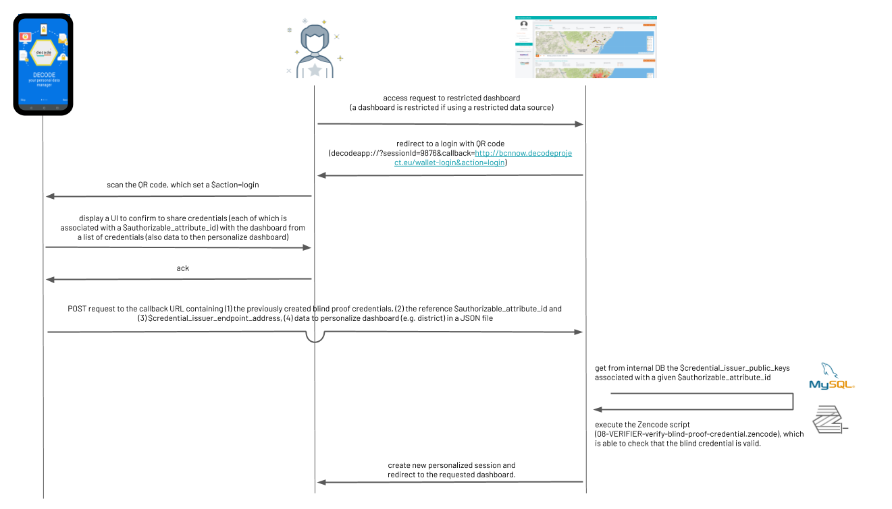

# Credential issuing in use for the BCN Pilots: Log-in and attribute verification

This document tries to summarize the use of the credentials in the BCN pilots, covering all cases (log-in to dashboard, credential use) except the specific details of the petition signature process. It is aimed as a guide for further pilots, to unify vocabulary and simplify interaction among developers.

## Notation and documentation

- Variables are referenced like `$variable` 
- Important ontology elements are referenced with CAPS (like `CREDENTIAL ISSUER`).
- We try to use the same terminology as possible for both pilots, named **DDDC** and  **IoT** respectively.
- PLEASE try to document the repsective APIs using OpenAPI specs or something similar (swagger).

## References

---

## Pilot common structure:
- Admin (DDDC or Smart Citizen) which is in charge of setting up both `BCNNOW` and the `CREDENTIAL ISSUER API SERVICE` following the rules accorded with the respective users in off-line sessions. This admin needs a `$bcnnow-api-token` and a `$ci-api-token` to communicate securely with the respective APIs. Additionally, for the case of the IoT, SC admin also needs to be able to communicate securely with the `POLICY STORE`.
- The admin, in particular, needs to define the `ATTRIBUTES` which will require to be verified in order to participate in the pilots. Those `ATTRIBUTES` will have the following properties:
  - `$authorizable_attribute_id`: Unique ID identiying the `ATTRIBUTE` (attribute susceptible to be validated via a credential)
  - `$authorizable_attribute_info`: Group of `($attribute_info_key:($attribute_info_type, $attribute_info_value)` that the users will need to provide in order to obtain a credential. The contents of the `$attribute_info` (key,value)  pairs provided by the user, will be first enforced by the `APP` according to the `$attribute_info_type` specifications and then enforced by the `CREDENTIAL ISSUER API SERVICE`, which will then will check wether the `$attribute_info_values` inputed by the user are present in the `$attribute_info_value_set`. For each pilot, those will be:
    - DDDC: String CODE + Email & array of permitted codes and array of permitted emails (strings both).
    - IOT: String CODE + username & array of permitted codes and array of permitted usernames (strings both).
  - `$credential_issuer_endpoint_address`: API endpoint with exposed methods. There will be **one credential issuer service per pilot**, packaged in Docker files and deployed either by each pilot or by Dyne (as DDDC currently is).
  - `$credential_issuer_name`: Name to identify who is providing verification for each credential (in this case, it will be DDDC (DDDC) and SmartCitizen (IoT) respectively).
  - `$credential_issuer_unique_id`: Unique ID identifying the `CREDENTIAL ISSUER` associated with the credential, the mapping between `$credential_issuer_name` and `$credential_issuer_unique_id` is one to one.
  - `$credential_issuer_public_keys`: Public keys generated by the `CREDENTIAL ISSUER` responsible for distributing the credentials, **there is one set of keys generated for each particular `ATTRIBUTE`**. The `CREDENTIAL ISSUER` is responsible to track and map each pair of keys to each `$authorizable_attribute_id` which identifies the `ATTRIBUTE` and its associated credentials.
- The attributes to obtain verification for will be in the pilots:
  - DDDC: "I have right to participate in petition `$petition_id`".
  - IoT: "I belong to community `$community_id`.
  > Note that the mapping `$community_id-$petition_id-$authorizable_attribute_id`is ONE TO ONE. In those notes, we will use `$authorizable_attribute_id` for generality.
- The `CREDENTIAL` will be used for login into the `BCNNOW DASHBOARD` as well as to decide eligibility to participate in pilot:
  - DDDC: Right to sign petition in ledger for petition `$petition_id`
  - IoT: Right to submit data to the encrypted data store for community `$community_id` and the right to access a dashboard to read all data collected for the community `$community_id`
- For the special case of the DDDC pilot, the `CREDENTIALS` will be issued once per unique values of `$attribute_info`, to preserve uniqueness of petition signatures. This means two things:
   - **If the user loses the credential, she will not be allowed to obtain new credentials**
   - **The `CREDENTIAL ISSUER` needs to keep track of the (HASHED) `$attribute_info` received arrays, and DENY credentials if one credential has been issued already to a requestes `$attribute_info` array (in the DDDC, a pair ('email':'ula@ulahop.com', 'code':'X23455') for instance.
   

## Current Status:

- API is implemented for a *multiple* attribute credentials. In the following, we have the mapping:
   - `·$petition_id / $community_id -> $authorizable_attribute_id -> $authorizable_attribute_credential_issuer_keypairs`. That is, there is a keypair generated by the CREDENTIAL issuer per `ATTRIBUTE`(identified by `$authorizable_attribute_id`).
   - It also means, that whenever **we use credentials for authorization, for instance in the `BCNNOW DASHBOARD`, the credential need to be passed along with meta data containing the  `$credential_issuer_endpoint_address` and the `$authorizable_attribute_id` in order for the VERIFIER (the DASHBOARD in this case) to retreive the public keys and execute the zenroom verification script**. See step 8 in [COCONUT flow](https://github.com/DECODEproject/dddc-pilot-contracts).

## Set-up Logic

### Credential issuer, policy setup and log-in setup (both pilots)

1. `PILOT ADMIN` defines an `ATTRIBUTE` via the set (variable) `$authorizable_attribute_info` for which the credential issuer will be able to issue a `CREDENTIAL` confirming their validity for a participant in the Pilot. The `CREDENTIAL` will validate the `ATTRIBUTE` defined above for each pilot.

2. `PILOT ADMIN` receives a `$credential_issuer_authorization_token` which allows them to issue data creation requests to the credential issuer API service (defined by `$credential_issuer_endpoint_address`). It also receives a token to communicate with the BCNNow dashboard.

3. `PILOT ADMIN` makes a POST call, including the `$credential_issuer_authorization_token` as an Authorization header to create a new `AUTHORIZABLE_ATTRIBUTE` sending over the defined attributes via a data structure called `$authorizable_attribute_info`. An `AUTHORIZABLE_ATTRIBUTE` is a record stored by the credential issuer that defines the `ATTRIBUTES` for which the credential issuer will issue credentials. The API returns a `$authorizable_attribute_id` that will be use to identify the credential associated with the attribute issued by this credential issuer. The request must include a special field `$authorizable_attribute_unique` which is a boolean value specifying if the credential issuer must keep track or not of the provided credentials (see below). **For IoT case `$authorizable_attribute_unique=False` and for DDDC case `$authorizable_attribute_unique=True`**.

4. The credential service receives the POST request, verifies its validity and saves the record, and returns an `$authorizable_attribute_id` which uniquely identifies the attribute/community, which is mapped respectively to the `$community_id` and `$petition_id` for each pilot. Also, the credential issuer HASHES the `authorizable_attribute_info_set` (the set of valid values for the `$authorizable_attribute_info`), which will be used for census check. (In the pilot cases, a set of valid usernames/emails and a set of valid alphanumeric codes). Last but not least, the credential issuer service generates a PAIR of keys and stores them and assigns them to the `$authorizable_attribute_id` (step 3-4 of the COCONUT flow). It also creates a new endpoint `$credential_issuer_endpoint_address/authorizable_attribute_id` where you can get back in a public way via GET request the `$authorizable_attribute_info` types and keys (in our case, the field "email" and "code" and the type string) as well as the public keys needed to verify the credentials for this `$authorizable_attribute_id` (in our case, community/petition).

5. (**IoT specific**) `PILOT ADMIN` creates an `ENTITLEMENT POLICY` which defines a community (`$community_metadata`) and also defines a set of s for that community (`$community_operations_info`). In addition to the configuration previously defined for a community, we also add the `$credential_issuer_endpoint_address`, and the `$authorizable_attribute_id` fields. These fields are required so that the app knows how to obtain credentials for the community. 

6. (**IoT specific**) The `PILOT ADMIN` builds a request object containing the variables defined above (`$community_metadata`, `$community_operations_info`, `$credential_issuer_endpoint_address`, and `$authorizable_attribute_id`), and sends a create request to the `POLICY STORE`. The `POLICY STORE` component receives this request, validates the incoming data includes all required fields and stores the policy information into its local datastore, generating a unique `$community_id`. 

7. (**IoT specific**) The `POLICY STORE` then also is responsible for sending a POST request to the Dashboard API to tell the dashboard about the new community. This request must include the name of the community, the generated `$community_id`, the `$credential_issuer_endpoint_address`, as well as the `$authorizable_attribute_id`.

8. (**IoT specific**) Upon receiving a request, the `BCNNOW DASHBOARD` parses the (authorized) request, and generates a `$bcn_now_dashboard_id` mapped to each `$community_id/petition_id` which is mapped also to the `$authorizable_attribute_id`. It then queries the `$credential_issuer_endpoint_address/$authorizable_attribute_id` to obtain the public keys needed to verify credentials for the given petition/community. The Dashboard API also uses Zenroom to generate a new keypair for the community data encryption, returning the public key and  `$bcn_now_dashboard_id`  to the `POLICY STORE` which stores this along with the other policy information.

8. (**DDDC specific**) `PILOT ADMIN` defines a name for community/petition, issues a post to Dashboards API and specifies the `ATTRIBUTE` needed to access each dashboard, identified by a `$authorizable_attribute_id` as well as a `$community_id/petition_id` and the `$credential_issuer_endpoint_address`. For both pilots it uses two different endpoints:
  - ~~ IoT: Dashboard links it to `$authorizable_attribute_id` number and gives public key back to community admin and a `$bcn_now_community_id` (for internal mapping to the attribute_id).~~ 
  - DDDC: Dashboard links it to `$authorizable_attribute_id` number and a `$bcn_now_community_id`. 

  > TO NOTE: A given `$community_id/petition_id` can be associated to one and only one `$authorizable_attribute_id`. Any service should be able to store and make this mapping (`$community_id/petition_id` to `$policy_id`  **IOT case** to `authorizable_attribute_id` to `bcn_now_dashboard_id` with a DB via a many to one relationship table or something of the sort.

9. (**DDDC specific**) Upon receiving a request, the `BCNNOW DASHBOARD` parses the (authorized) request, and generates a `$bcn_now_dashboard_id` mapped to each `$community_id/petition_id` which is mapped also to the `$authorizable_attribute_id`. It then queries the `$credential_issuer_endpoint_address/$authorizable_attribute_id` to obtain the public keys needed to verify credentials for the given petition/community. 

### Credential issuing

#### IoT

1. User goes through the onboarding application of SC which collects the geolocation and the exposure of the device.
2. In the middle of the onboarding, user is prompted to install DECODE app as will be needed to complete flow.
3. Onboarding application generates QR code containing the device token, geolocation and exposure and `$action=iot-onboarding` so the APP knows what screen to show.

> Please see the [QR handling notes](./qr_handling.md) for details on the speciffics of QR codes for DECODE project.

4. App queries policystore for list of `$community_config` values, that specify the available communities.The returned list contains the community description, a list of its operations and importantly the `$credential_issuer_endpoint_address` and the `$authorizable_attribute_id`.
5. The user chooses a community to join with their device via app UI.
6. App generates a keypair, step `01-CITIZEN-request-keypair.zencode` in coconut flow.
7. App queries the `$credential_issuer_endpoint_address/$authorizable_attribute_id` and gets information on the `$authorizable_attribute_info` fields and types.
8. App then presents a UI to the user that allows them to enter the values required for the `$authorizable_attribute_info`.
9. User inputs the information and validates the types.
10. At this point the app executes step `02-CITIZEN-request-blind-signature.zencode` of the coconut flow. Before this, it needs to string hard-core substitute the sentence `I declare that i belong to $community_id`.
11. App issues a request to the `$credential_issuer_endpoint_address` i.e. a URL that uses the `$authorizable_attribute_id` to identify the attribute and including the `$authorizable_attribute_info` in the request body as well as the output of step 2 of the COCONUT flow.
12. The credential issuer receives the request, parses the incoming data and does the following (case `$authorizable_attribute_unique=False`):
  * Checks each of the fields presented by the user are in the `$authorizable_attribute_info_set`. If all are valid, then proceeds. Otherwise, throws an identification error back at the app.
  * If previous step is satisfactory, it executes step `05-CREDENTIAL_ISSUER-credential-blind-signature.zencode` in the COCONUT flow. And returns the output to the app.
13. App also executes the Zencode script (`07-CITIZEN-blind-proof-credential.zencode`), which also is stored ready to be presented to anyone needed to check its validity.
10. App makes call to stream encoder component to create the new encrypted stream (as per existing IoT pilot flow)

#### DDDC
> For earlier notes and considerations, see [credentials doc](./credentials.md).

1. User installs DECODE App and sets up desired data.
2. User goes to DDDC website visits petition she is interested in signing. Clicks on the link (mobile navigation) or scans QR (desktop navitaion).
3. App is triggered, the QR encodes information about the petition via a `$petition_id`. The app queries the `DDDC GraphQL API` for peittion info via the `$petition_id`. It gets back information about the peittion, in particular the `$authorizable_attribute_id` and `$credential_issuer_endpoint_address` associated with the petition.
4. The user is asked via APP UI to obtain a credential to participate in the petition. To which the user agrees.
5. App generates a keypair, step `01-CITIZEN-request-keypair.zencode` in coconut flow.
6. App queries the `$credential_issuer_endpoint_address/$authorizable_attribute_id` and gets information on the `$authorizable_attribute_info` fields and types.
7. App then presents a UI to the user that allows them to enter the values required for the `$authorizable_attribute_info`.
8. User inputs the information and validates the types.
9. At this point the app executes step `02-CITIZEN-request-blind-signature.zencode` of the coconut flow. Before this, it needs to string hard-core substitute the sentence `I declare that i can participate in $petition_id`.
10. App issues a request to the `$credential_issuer_endpoint_address` (in the new method to be defined, which is a merge of the current methods `/blind_signature` and `/validate_attribute_info`) i.e. a URL that uses the `$authorizable_attribute_id` to identify the attribute and including the `$authorizable_attribute_info` in the request body as well as the output of step 2 of the COCONUT flow.
11. The credential issuer receives the request, parses the incoming data and does the following (case `$authorizable_attribute_unique=True`):
  * Checks each of the fields presented by the user are in the `$authorizable_attribute_info_set`. If all are valid, then proceeds. Otherwise, throws an identification error back at the app.
  * Combines all of the inputed  `$authorizable_attribute_info` values and maps them via a HASH function to a `$authorizable_attribute_info_value_hash`.
  * It checks wether the `$authorizable_attribute_info_value_hash` is on the Database of issued credentials. It it is, the **credential** is denied. It throws an error back to the app.
  * If it is not, it is stored on the DB as a an entry `$authorizable_attribute_info_value_hash:$timestamp`.
  * If all previous steps are satisfactory, it executes step `05-CREDENTIAL_ISSUER-credential-blind-signature.zencode` in the COCONUT flow. And returns the output to the app.
12. App also executes the Zencode script (`07-CITIZEN-blind-proof-credential.zencode`), which also is stored ready to be presented to anyone needed to check its validity.

### Dashboard log-in (both pilots)

> For some extra earlier considerations see [BCNNow flow docs](https://github.com/DECODEproject/decodev2/blob/master/docs/legacy/BCNNow_dashboard_call.md)

1. The user goes to the BCNNow dashboard and attempts to access a restricted dashboard.
2. The BCNNow app knows the dashboard is restricted, so instead of showing the dashboard, redirects the user to a login screen that shows a QR code and has a message instructing the user to scan the QR code in order to login. This QR code defines a URL of the following form: `decodeapp://?sessionId=9876&callback=http://bcnnow.decodeproject.eu/wallet-login&action=login`. If user is accessing from Mobile, the QR is a button with the same link. `$sessionId` would be a  unique ID generated for every call to Login.

3. The user opens their app, and scans the QR code, which set a `$action=login` or presses the button.

4. The app displays a UI where the user can confirm they wish to share their credentials (each of which is associated with a `$authorizable_attribute_id`) with the dashboard from a list of credentials. The user can also choose which data he/she wants to share with the dashboard to personalize her experience.
5. If the user agrees, then the app sends a POST request back to the callback URL containing the previously created blind proof credential to the dashboard, as well as the reference `$authorizable_attribute_id` and `$credential_issuer_endpoint_address`. It also contains extra information in a JSON file that allows to personalize the view.

6. The dashboard queries or gets from internal DB the credential issuer public keys associated with a given `$authorizable_attribute_id` from the provided `$credential_issuer_endpoint_address`. The dashboard executes the Zencode script (08-VERIFIER-verify-blind-proof-credential.zencode), which is able to check that the blind credential is valid. This script requires a `$authorizable_attribute_id` passed earlier by the app. The dashboard then queries the `$credential_issuer_endpoint_address` and asks for the `$validation_keys` that are the input of the needed script to validate the credentials.

7. If the credential is valid then the dashboard creates a new session for the user, and logs them in, redirecting to the requested dashboard. Either on the same device (if it is on the phone) or via callback on the browser

<media-tag src="/blob/6b/6b25946cba8ae40167ce06749a56a2c73c07e21610eb0049" data-crypto-key="cryptpad:7ED5IPQKTJyrZ3z51xD8CbRmDoxrqnSZzmo453eJWHQ="></media-tag>
Source: https://docs.google.com/presentation/d/1UVeYiP4KQ2yFgUq6O2Y0NwE_g7kZfCKb6THeb3vYajg/edit

# Credits

Authors: Oleguer Sagarra (Dribia) with edits from Sam Mulube (Thingful), and Rohit Kumar (Eurecat)
