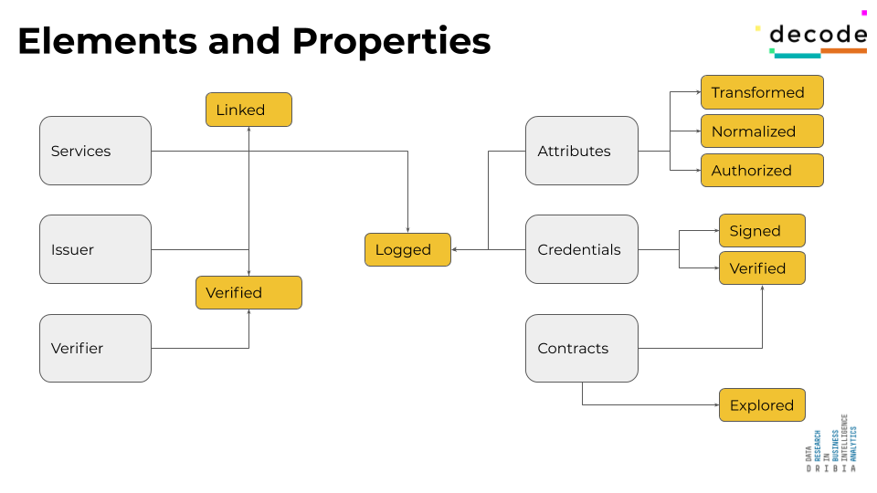
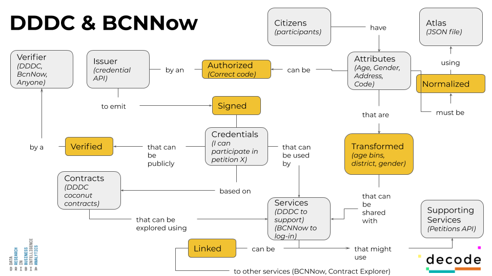
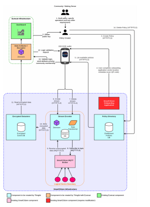
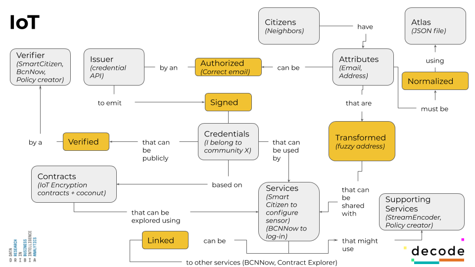

## Table of contents
- [DECODE App Objectives and philosophy](#app-philosophy)
- [DECODE App Taxonomy](#app-taxonomy)
- [Adding applications to the app](#app-add)

## DECODE App Objectives and philosophy

The DECODE app is intended to be a multilingual piece of software for users to easily use DECODE functionality. It represents the merging point of the diverses DECODE researched technologies, such as cryptographic languages ([Zenroom](wwww.zenroom.org)), schemes ([COCONUT](https://arxiv.org/pdf/1802.07344.pdf)), [credential management APIs](https://github.com/DECODEproject/credential-issuer) as well as distributed enhanced services (such as [petitions API](https://github.com/DECODEproject/dddc-petition-api) and [IoT encoder](https://github.com/DECODEproject/iotencoder)). It is built based on four core principles.

- Minimization: The main purpose of the app is the easy and intuitive management of attributes and credentials, as such, any other added service not involving attributes or credentials shall be leveraged externally to the app via appropriate back-ends. Those, however, must adapt to a common standard to ensure generalization.
- Self-containment: Also, in order to preserve users’ privacy, the app does not rely on any back-end service to work. However, it uses the back-end services of the use cases it is used for.
- Context: The app is built on the principle that users activate the app to interact with known services, following a user journey based on the paradigm app-service-app. For more details see the details of the UX design in deliverable (D4.10). 
- Customization: The app implements the requirements for usability for two concrete use cases, BCNNow and DDDC in three different languages (Catalan, Spanish and English). Yet, it is designed with the potential to be generalized to other use cases. A fully fledged example on how to do so is included for the IoT case.

In order to achieve this, we present in the following section a general taxonomy of the elements involved in the app together with its practical implementation to the two considered use cases. Any service wishing to integrate DECODE technology, shall need to perform the same mapping here present for its concrete use case (an example for the IoT case is provided in the final part of this document).


## DECODE App taxonomy

The DECODE ecosystem can be understood as roughly comprised of 6 main elements, derived from the ongoing research (see [DECODE Whitepaper](https://github.com/DECODEproject/whitepaper)):

- Services/apps: External services that wish to use DECODE technology and integrate on the ecosystem. Those services can in turn have supporting back-end services that help them provide the purpose they are built for.
- Attributes: Any kind of data related to a user in the DECODE universe. Those attributes must be normalized according to a common set of standards, which we call the ATLAS. Also, those attributes can be transformed into derived attributes. For example, an age or an age range can be transformed from a birth date, the same as a city can be derived from a precise location. Also, attributes can be included into credentials and be authorized, (see more below).
- Credentials, Issuers, Verifiers and contracts: Credentials are statements proposed by users. Those can be signed and hence endorsed by an Issuer and can be verified by a Verifier (entity that provides proof of the integrity and validity of the statement, not on its contents). All this is managed through cryptographic contracts, which can in turn be inspected thanks to Zenroom natural language syntax (see more on deliverable XXX).

The properties that those elements can have are sketched below.



### Relations
Any service or app wishing to integrate itself in the DECODE ecosystem, must fit into the schematic relationship scheme provided below in figure xx, and explained here.

The starting point is always the user, which can input some attributes into the DECODE app (potentially personal data). Those attributes must be normalized to conform to a common standard, called ATLAS. Also, those base attributes can be transformed into less informative ones (to preserve certain degree of anonymity) in order to be shared with services. For instance, transforming a given address into a city of residence.

A user can provide certain attributes (a user name, a password, a code, an identity card) that must be authorized by a recognized Issuer (for instance a city council) to emit a signed credential. Those credentials can be verified by anyone wishing to verify their integrity via a Verifier instance. Once a credential is signed, it can be used to provide proof of statements such as “I am over 18 years old”. This statement, uses a derived attribute from a birth date, and is signed by an Issuer. All this process is governed via cryptographic contracts, written in Zenroom language.
Once a user has credentials, it can use those credentials to make use of the federated services/apps, which can optionally rely on supporting services (all outside of the app). As a service is added to the DECODE ecosystem, it can declare its link to other existing service, so user can benefit from both (for instance, a visualization service to visualize data from using another declared service).
 


### Pilot mapping: DDDC & BCNNow
The above relations must be mapped to actual existing instances in the real world for any service or app wishing to integrate itself into the DECODE ecosystem. Below, we provide explicit mappings of those instances for the BCNNow and DDDC use cases, belonging to the pilots developed in Barcelona.




In these use cases, users are the citizens of Barcelona. They input their address, age and gender into the app and the app transform those values into approximate locations and age ranges. The users participate into the DDDC deliberation process, and are given a unique participatory code to be able to support petitions displayed on the site.
 
This code is used to obtain a credential, signed by the DECODE credential issuer (see Technological implementation section for details below) that validates the statement “I can participate to support petition X”, being X a petition chosen by the user. The credential, can be presented to any instance wishing to verify it, which can be done at a public endpoint of the credential issuer itself. At the moment of asking for a credential, the user is given the option to share derived data (gender, blurred address and age range) with the credential issuer for statistical purposes. 
 
Once the user is in possession of the credential, it can use it for two actions in two different apps or services (which are linked):

1. It can support a petition chosen from the DDDC website. To do so, DDDC uses the supporting service that manages the petitions support in a distributed way over a ledger (see deliverable DXX).
2. It can use the same credential to log into BCNNow website. Upon doing so, the site also asks for some derived data that the user can share in order to personalize her experience.

All those actions can be done via the app, either by clicking on a link with the appropriate handle while being on a mobile environment, or by scanning a QR code that the app can recognize. Below, we provide the technological implementation details that explain the entire process.

## Adding supported applications to the app: DECODE IoT web service example

Given the above description of the DECODE App taxonomy and its relations, we here add an example of integration of a new (existing) app.

All of the below changes can be followed in the branch 'add_iot' of the main repository.

Below, we follow all the steps needed to perform a successful integration of the service, starting with a brief description of it.

1. Making the service ready
    - Developing the tech
    - Adapting the implementation to the DECODE taxonomy
    - Documenting and setting up the APIs.
2. Declaring services and data to ATLAS
    - ATLAS declaration of services and data + translations
    - Write converter functions
    - Write API clients
3. Writing the business logic functions
4. Implementation of the app screen visuals
5. Implementation of QR and handle triggers
6. Testing

### Introduction: The IOT service

The IoT DECODE service is implemented already in the form of a [web-app](http://iot.decodeproject.eu).
It provides support to an ongoing pilot in Barcelona part of the decode project, in collaboration with [smartcitizen](http://smartcitizen.me).
The pilot verses about enabling users to gather environmental data using IoT sensors based on open hardware, called *smart citizen kits*.

Once the sensors are set-up (see process [here](start.decode.smartcitizen.me)), users are given the option to share the data they produce under different conditions.

Those conditions are termed "policies". A policy is a group of data transformations that simplify the data, 
that allow users to share their readings in a simplified way with a group of other users. A group of users that has agreed on a policy of sharing is called a *community*.

More details are provided in the deliverables of the project, in particular [D 6.5 Deployment_pilots_bcn](https://decodeproject.eu/publications/deployments-pilots-barcelona).

Additional details are provided in the [flow file](./iot_flow.md) in this repository
#### Existing services and UX

Currently the IoT service relies on a variety of services, mainly:

- *SmartCitizen for onboarding sensors*: The onboarding process allows sensors to send data to a configured MQTT server. 
When the onboarding is finished, the user is prompted to get an account in the DECODE universe.
- *DECODE Web-app*: With this account, the user can obtain credentials that validate the statement "I belong to community X", being "X" any of the existing communities.
To belong to a community, the user must be in posession of a certain validation code (provided by the community). This mirrors the same process of credential obtention of the DDDC app.
- *DECODE policy store*: The DECODe policy store is an API that provides a list of existing and declared policies (or communities) via a `communityId`.
- *DECODE stream encoder*: Once the user belongs to a community. The sensors' MQTT broker is redirected to the [stream encoder](https://github.com/DECODEproject/iotencoder).
The stream encoder is fed with the speciffic *communityId* where the users wishes to subscribe the sensor (a sensor can be subscribed to multiple communities) and with an MQTT stream. Then, the strem encoder performs the necessary data transformations, encrypts the data and submits it to the *DECODE policy store*.
- *DECODE policy store*: The DECODE [policy store](https://github.com/DECODEproject/iotpolicystore) stores the encrypted streams from the Stream encoder. If users possess the appropriate credentials of belonging to a given community, users can then query the store, download the data and decrypt it accoringly.
- *BCN Now dashboard*: In this pilot, the task of data decryption, is done by another DECODE compatible service: The [BCNNow service](http://bcnnow.decodeproject.eu)




#### Taxonomy

The IoT service taxonomy is easy to map to the earlier defined taxonomy. It can be followed below, to simplify the process of adapting the app.

We see that what will be needed is just the business logic of:

- Obtaining a credential ("I belong to community X")
- Setting up the supporting services (StreamEncoder, Policy Store, IoTStore)
- Linking to the UX website (smartcitizen)




#### Implementation

Luckily, most of the heavy lifting, including the cryptographic work, is done by the policy store API, so the changes to the app are minimal. We only need to cater for:
1. Obtaining a credential (which is an exact copy of the DDDC process)
2. Managing the `communityId` and passing it along services, from the sensor to the credential issuer to the policy store.
3. Storing the credentials (which the app already does) for later use in BCN Now (which the app also does). 
4. Adapting the screens of the process.
5. Declaring the new service into the ATLAS file.
6. Writting down the API calls to the policy store needed to make the system work.

##### Styles declaration

Styles: In this case we do not want to customize the theme, so we do not alter the file src/lib/theme.js.

##### ATLAS declaration

We declare the service in the json atlas. As it only uses the users address, we don't need to add anymore data. However, for the fun of it, we add a "blurredAdress" field.

```json
	{
  	"attributes": {
    	"blurredaddress": {
      	"name": "blurredaddress",
      	"type": "string",
      	"description": "blurredaddressDesc",
	  		"derivedFrom": "address",
    	}
  	},
		... 
    "iot": {
      "id": "iot",
      "name": "iotName",
      "title": "iotTitle",
      "image": "iotIcon",
      "link": "https://start.decode.smartcitizen.me/",
      "description": "iotDesc",
      "sharedAttributes": ["blurredaddress"]
    }
```
We must add an icon `icon-iot.png` to the folder /src/api/atlas/images/ and make sure the app knows how to import it (index.js)

We add translation objects to the file as well:

```json
      "en": {
        "dddcName": "DDDC",
        "dddcTitle": "Sign a petition in DDDC",
        "dddcDesc": "DECODE allows to sign petitions of the DDDC platform in an anonymous, safe and auditable way.",
        "bcnnowName": "BCNNow",
        "bcnnowTitle": "Enter BCNNow",
        "bcnnowDesc": "BCNNow allows to enter the platform in an anonymous way, but sharing some data to obtain personalized visualizations."
        "iotName": "IoT DECODE smart citizen",
        "iotTitle": "Contribute to the IoT data commons",
        "iotDesc": "Smart citizen IoT allows you to record data from open hardware sensors and share it with your community at different granularity levels."
      }

```
(and also the new derived data field translation, not shown)


##### Converter declaration

We must also declare a new converter for the `blurredAddress` field. We do so at /redux/converters/, adding a new file 'blurredaddress.js'.

In the example, we return a simple string.

```javascript
/* here write complicated function change, for the moment does nothing */
export default address => address;
```

##### API declaration

The IoT service uses the same credential issuer as the DDDC service, so no changes must be added here. However, it also uses an additional api service, the [IoT policy store](https://github.com/DECODEproject/iotpolicystore). So a new file `iot-client.js` must be added with the relevant API calls to trigger.

##### Business logic declaration

We must add the business logic declaration. To do so, we must add a new file to /src/redux/modules/applications/ called 'iot.js'. 

```javascript
import { createSelector } from 'reselect';
import moment from 'moment';
import { path, prop } from 'ramda';
import { fetchCommunity as fetchCommunityApi } from 'api/iot-client';

export const initialState = {
  loading: false,
  uses: [
    {
      sharedData: ['blurredAddress'],
    },
  ],
  certificates: 1,
};

export const ACTIONS = {
  FETCH_COMMUNITY_REQUEST: 'FETCH_COMMUNITY_REQUEST',
  FETCH_COMMUNITY_SUCCESS: 'FETCH_COMMUNITY_SUCCESS',
  FETCH_COMMUNITY_FAILURE: 'FETCH_COMMUNITY_FAILURE',
};

export const fetchCommunity = (url, id) => async (dispatch) => {
  dispatch({
    type: ACTIONS.FETCH_COMMUNITY_REQUEST,
    url,
    id,
  });
  try {
    const petition = await fetchCommunityApi(url, id);
    dispatch({
      type: ACTIONS.FETCH_COMMUNITY_SUCCESS,
      petition,
    });
  } catch (e) {
    dispatch({
      type: ACTIONS.FETCH_COMMUNITY_FAILURE,
      error: e.message,
    });
  }
};

const getBranch = path(['applications', 'iot']);

export const getCommunity = createSelector(
  getBranch,
  prop('community'),
);

export const getLoading = createSelector(
  getBranch,
  prop('loading'),
);

export const getError = createSelector(
  getBranch,
  prop('error'),
);

export default (state = initialState, action) => {
  switch (action.type) {
    case ACTIONS.FETCH_COMMUNITY_REQUEST: {
      return {
        ...state,
        loading: true,
        community: null,
        error: null,
      };
    }
    case ACTIONS.FETCH_COMMUNITY_SUCCESS: {
      return {
        ...state,
        loading: false,
        community: action.community,
      };
    }
    case ACTIONS.FETCH_COMMUNITY_FAILURE: {
      return {
        ...state,
        loading: false,
        error: action.error,
      };
    }
    default:
      return state;
  }
};
```

In this case, the logic is fairly similar to DDDC. You basically need to:

1. Obtain credential at credential issuer (same as DDDC)[not done yet]
2. Declare your sensor with this credential by joining a community at the policy store. [not done yet]
##### Screen declaration

We must now declare the different screens that the app will use. To do so, we head to /src/screens/applications/ and create a new folder 'iot'.

First we edit the index.js file to point to `IOT.Component`

```javascript
export default from './IOT.Container';
```

Then we edit IOT.Container file to use the business logic just declared.

```javascript
import { connect } from 'react-redux';
import { createStructuredSelector } from 'reselect';
import { getSharedAttributes } from 'redux/modules/attributes';
/* edit this line */
import { fetchCommunity, getCommunity, getLoading, getError } from 'redux/modules/applications/iot';
import Component from './IOT.Component';

const mapStateToProps = createStructuredSelector({
  sharedAttributes: getSharedAttributes('iot'),
  community: getCommunity,
  loading: getLoading,
  error: getError,
});

const mapDispatchToProps = dispatch => ({
  fetchCommunity: (url, id) => dispatch(fetchCommunity(url, id)),
});

const ConnectedComponent = connect(mapStateToProps, mapDispatchToProps)(Component);

ConnectedComponent.navigationOptions = Component.navigationOptions;

export default ConnectedComponent;
```

And we add the visual elements in IOT.Component.js . This example heavily mirrors DDDC case as the two are quite equivalent, substituting "petition" per "community".

```javascript

import React, { useEffect } from 'react';
import { View, Linking, Dimensions, Button } from 'react-native';
import PropTypes from 'prop-types';
import { isNil } from 'ramda';
import { useTranslation } from 'react-i18next';
import HTML from 'react-native-render-html';
import Spinner from 'react-native-loading-spinner-overlay';
import { getDisplayValue } from 'lib/utils';
import { Screen, Heading, Line as Text } from './IOT.Styles';

const IOT = ({
  navigation: { getParam },
  sharedAttributes,
  fetchCommunity,
  community,
  certificate,
  loading,
  error,
}) => {
  const iotUrl = getParam('iotUrl') || 'https://policystore.decodeproject.eu/api';
  const communityId = getParam('communityId') || '2';
  const { t } = useTranslation('applications');
  const { t: attributesT } = useTranslation('attributes');
  useEffect(
    () => {
      fetchCommunity(iotUrl, communityId);
    },
    [communityId],
  );
  return (
    <Screen>
      <Spinner visible={loading} />
      <Heading>{t('activated')}</Heading>
      {
          community ? (
            <HTML
              id="description-text"
              html={community.description}
              imagesMaxWidth={Dimensions.get('window').width}
              onLinkPress={(event, href) => { Linking.openURL(href); }}
            />
          ) : null
        }
      {
          isNil(certificate) ? (
            <View>
              <Text>{t('certificateRequired')}</Text>
              <Button title={t('more')} onPress={Function.prototype} />
              <Button title={t('certificateRequestButton')} onPress={Function.prototype} />
            </View>
          ) : null
        }
      {
          error ? <Text>{error}</Text> : null
        }
      <Heading>Will share this data</Heading>
      {
          sharedAttributes.map(({ name, value, type }) => (
            <Text key={name}>{`${name}: ${getDisplayValue(type, value, attributesT)}`}</Text>
          ))
        }
    </Screen>
  );
};

IOT.navigationOptions = ({ screenProps: { t } }) => ({
  title: t('applications:iotName'),
});

IOT.defaultProps = {
  community: null,
  error: null,
  certificate: null,
};

IOT.propTypes = {
  sharedAttributes: PropTypes.arrayOf(PropTypes.shape({
    name: PropTypes.string.isRequired,
    value: PropTypes.string.isRequired,
  })).isRequired,
  navigation: PropTypes.shape({
    getParam: PropTypes.func.isRequired,
  }).isRequired,
  fetchCommunity: PropTypes.func.isRequired,
  community: PropTypes.shape({
    description: PropTypes.string.isRequired,
  }),
  loading: PropTypes.bool.isRequired,
  error: PropTypes.string,
  certificate: PropTypes.string,
};

export default IOT;
```

If need be, we edit the styles at the IOT.Styles.js file.

##### QR & handle trigger declaration

Declare the new action to trigger the QR and the handle directly at /src/lib/utils.js.

```javascript
  // Try to interpret as IoT declaration
  const { query: { iotAPIUrl: iotUrl, communityId } } = urlObj;
  if (iotUrl && communityId) return {
    application: 'iot',
    iotUrl,
    communityId,
  };
```
Need to declare the handle as well (not done as of yet).

##### Writting test functions

To clean up, do not forget to write test calls to all the declared functions and features. To do so, head to `/__tests__/` and finalize the work.

File applications.spec.js

(only added lines present)
```javascript
import { initialState as iotInitialState } from 'redux/modules/applications/iot';

{
  id: 'iot',
  name: 'iotName',
  title: 'iotTitle',
  image: 'icon-iot',
  link: 'http://start.decode.smartcitizen.me',
  description: 'iotDesc',
  usageCount: 0,
  numCertificates: 0,
},

```

File attributes.specs.js

````javascript

import getBlurredAddress from 'redux/converters/blurredAddress';


...
  test('Calculate blurredAddress', () => {
    expect(getBlurredAddress().toEqual('Empty Adress');
  });


````

File root.spec.js

````javascript

import { initialState as iotInitialState } from 'redux/modules/applications/iot';


const initialApplications = {
  dddc: dddcInitialState,
  bcnnow: bcnnowInitialState,
  iot: iotInitialState,
};

````


## Conclusion

Congratulations! You made it here, so your new service is up and running. To note, porting a service to DECODE can be as easy as that. Please don't be shy and try it out!


